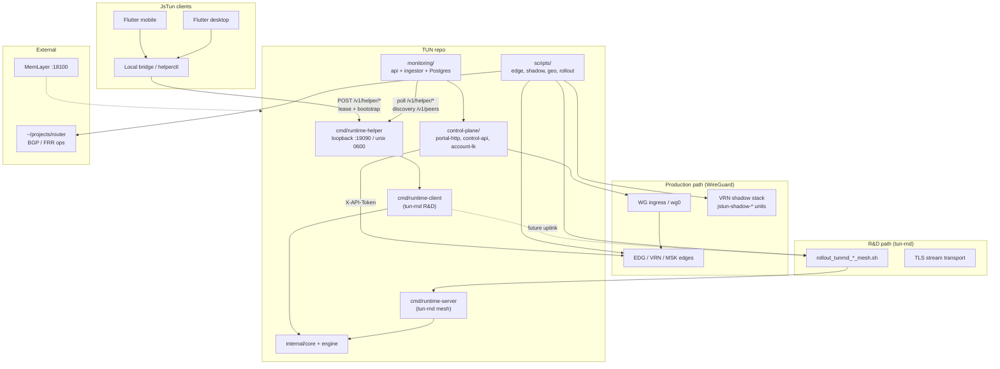

# Аудит репозитория TUN (JsTun Access Platform)

**Дата:** 2026-05-19  
**Режим:** read-only (код не менялся, коммиты не создавались)  
**Путь:** `/Users/just/projects/TUN`  
**Remote:** `git@github.com:justadm/TUN.git` (ветка `main`, commit `9272290`)  
**Связанные репозитории:** `/Users/just/projects/JsTun` (UI/mobile/desktop), `/Users/just/projects/router` (edge/BGP, отдельный lifecycle)

---

## 1. Executive summary

Репозиторий TUN по задумке — платформа доступа из трёх доменов (control-plane, edge/datapath, tun-rnd), но **фактическое состояние git сильно отстаёт от локальной рабочей копии**: в remote отслеживается только **44 файла** (ранний scaffold `tun-rnd` + ingestor), тогда как локально присутствуют **~12 600 строк shell**, полный `control-plane/`, `monitoring/`, `deploy/`, десятки `cmd/*` и `internal/runtime/*` — всё это **не закоммичено**. Это главный операционный риск: CI на GitHub прогоняет урезанный снимок, а production-артефакты и runbook’и живут только на машине разработчика.

Сильные стороны локальной копии: зрелый **runtime-helper** (legacy + `/v1/helper/*`, lease, SSE, idempotency), единый **release gate** (`scripts/release_gate_runtime_helper.sh`, `make gate-ci-*`), systemd hardening, redaction в support bundles, контракт с JsTun (bridge.autopilot, reconcile). **Production baseline (WireGuard)** отражён в `control-plane/` (Python portal/control-api, shadow VRN, LK migrations) и edge-скриптах; **tun-rnd mesh** вынесен в отдельные `rollout_tunrnd_*` / `gate_tunrnd_*`, но смешан с тем же Makefile — требует дисциплины при релизах.

Документация разделена корректно по политике (`docs/` канон, `.docs/` legacy), но **`.docs/` в `.gitignore`** — 106 decision logs (апрель 2026: cutover, shadow, billing, LK) не попадают в remote. Monitoring: рабочий docker-compose, ingestor с TG/MAX, profile-aware policy — зрелость **средняя**, без CI в tracked workflows.

**Вердикт:** для pilot **runtime-helper** на desktop — технически близко (gate + smoke + systemd), блокер — **git/CI parity** и обязательный auth token даже в unix-режиме на pilot-хостах. Для production WG/control-plane — нужен **массовый commit + разделение CI** (go-test vs helper-gate vs python/monitoring), DR/runbook в `docs/`.

---

## 2. Scorecard

| Домен | Зрелость (1–5) | Docs | Tests | Security | Ops |
|-------|----------------|------|-------|----------|-----|
| **tun-rnd / runtime (Go)** | 4 | 4 | 4 | 4 | 4 |
| **control-plane** | 3 | 3 | 2 | 3 | 3 |
| **edge / datapath** (`scripts/`) | 3 | 3 | 2 | 3 | 3 |
| **monitoring** | 3 | 4 | 2 | 3 | 3 |
| **repo / CI / hygiene** | 2 | 3 | 2 | 3 | 2 |
| **documentation (`docs/` + `.docs/`)** | 3 | 4 | — | — | 2 |

*Шкала 1–5: 1 — scaffold, 5 — production-ready с автоматизированными gate и DR.*

---

## 3. Architecture map



**Потоки данных (кратко):**

| Поток | Протокол | Владелец |
|-------|----------|----------|
| App → helper | HTTP loopback/unix, Bearer optional | TUN (`runtime-helper`) |
| Helper → tun-rnd runtime | in-process / subprocess | TUN |
| Admin/LK → portal | HTTP (Python) | TUN `control-plane` (UI shell в JsTun) |
| Monitoring ingest | HTTP helper + control-api fallback | TUN `monitoring` |
| Production access | WireGuard | Edge hosts + `control-plane` |
| R&D mesh | tun-rnd TLS + systemd | `scripts/rollout_tunrnd_*` |

---

## 4. Findings

### F-001 — Критический разрыв git vs локальная копия

| | |
|---|---|
| **ID** | F-001 |
| **Severity** | **critical** |
| **Domain** | repo |
| **Evidence** | `git ls-files \| wc -l` → **44**; `git status` — сотни `??` (control-plane, cmd/runtime-*, scripts/*, docs/, deploy/, Makefile, workflows/runtime-helper-gate.yml) |
| **Impact** | GitHub CI и коллеги видят другой продукт; потеря артефактов при смене машины; невозможен code review production-изменений |
| **Recommendation** | Структурированный commit (или серия PR): runtime-helper, control-plane, monitoring, scripts, docs, workflows; исключить `.tmp/`, `monitoring/.env`, `artifacts/` |

### F-002 — CI на remote не покрывает runtime-helper gates

| | |
|---|---|
| **ID** | F-002 |
| **Severity** | **high** |
| **Domain** | repo / tun-rnd |
| **Evidence** | Tracked: `.github/workflows/go-test.yml` только `go test ./...`; `.github/workflows/runtime-helper-gate.yml` — **untracked** |
| **Impact** | PR в main не ловят регрессии helper/smoke/contract-matrix |
| **Recommendation** | Закоммитить `runtime-helper-gate.yml`; на `push main` — `make gate-ci-full` или matrix (fast на PR, full на main) |

### F-003 — `.docs/` исключён из git

| | |
|---|---|
| **ID** | F-003 |
| **Severity** | **high** |
| **Domain** | docs |
| **Evidence** | `.gitignore:25` `/.docs/`; `find .docs -name '*.md' \| wc -l` → **106**; ключевые: `controlled-read-cutover-2026-04-03.md`, `edg-write-mirror-runbook-2026-04-03.md`, `jstun-reuse-assessment-2026-04-03.md` |
| **Impact** | Операционные decision logs и runbook’и недоступны команде через git |
| **Recommendation** | Либо снять ignore и коммитить `.docs/` (без секретов), либо перенести актуальное в `docs/runbooks/` и оставить `.docs/` только локальным архивом с явной политикой |

### F-004 — Unix-socket helper без auth token разрешён

| | |
|---|---|
| **ID** | F-004 |
| **Severity** | **high** |
| **Domain** | security / tun-rnd |
| **Evidence** | `cmd/runtime-helper/main.go:3086-3088` — TCP требует token; unix — нет; `requireAuth` no-op при пустом token (`:4394-4398`); socket `chmod 0600` (`:3162`) |
| **Impact** | Любой UID с доступом к socket path (или misconfigured `RuntimeDirectory`) получает полный helper API (tunnel.start, lease.takeover) |
| **Recommendation** | Pilot/production: всегда `-auth-token-file` + systemd `0600`; рассмотреть fail-closed если unix без token (кроме test env) |

### F-005 — Локальный `monitoring/.env` вне git

| | |
|---|---|
| **ID** | F-005 |
| **Severity** | **high** |
| **Domain** | security |
| **Evidence** | `find . -name '.env'` → `./monitoring/.env` (3990 bytes); не в `.gitignore` явно (только `monitoring/.env.example` tracked) |
| **Impact** | Риск случайного `git add` с TG/MAX tokens, DB password |
| **Recommendation** | Добавить `monitoring/.env`, `**/__pycache__/`, `.tmp/` в `.gitignore`; pre-commit secret scan |

### F-006 — Смешение production WG и tun-rnd в одном Makefile

| | |
|---|---|
| **ID** | F-006 |
| **Severity** | **medium** |
| **Domain** | edge / ops |
| **Evidence** | `Makefile`: `gate-ci-fast` (helper) рядом с `rollout-mesh-msk`, `gate-mesh-prod-release` (`rollout_tunrnd_*.sh`) |
| **Impact** | Оператор может выкатить R&D mesh, думая что это WG pilot |
| **Recommendation** | Разделить targets: `make helper-*` vs `make tunrnd-mesh-*`; README banner «R&D only» |

### F-007 — Опасные edge/bootstrap операции

| | |
|---|---|
| **ID** | F-007 |
| **Severity** | **medium** |
| **Domain** | edge |
| **Evidence** | `scripts/bootstrap/fra_bootstrap.sh:259` `ufw --force reset`; `scripts/geo_apply_remote.sh` `rm -rf` на remote; `rollout_tunrnd_*.sh` пишет ключи в `/etc/tun/*.env` через SSH |
| **Impact** | Потеря доступа к хосту при ошибке; утечка ключей в shell history на jump-host |
| **Recommendation** | Обязательный `--dry-run`, backup hooks (частично есть в geo); runbook «кто/когда» для fra bootstrap |

### F-008 — Низкое покрытие TUN open path на darwin

| | |
|---|---|
| **ID** | F-008 |
| **Severity** | **medium** |
| **Domain** | tun-rnd |
| **Evidence** | `go test ./... -cover` → `internal/tun` **15.0%**; `open_darwin.go` Open/Read/Write **0%** (CI на linux only) |
| **Impact** | Регрессии desktop (macOS) не ловятся CI |
| **Recommendation** | macOS job в CI или build tags + integration test на darwin runner |

### F-009 — `.docs/todo.md` устарел относительно кода

| | |
|---|---|
| **ID** | F-009 |
| **Severity** | **medium** |
| **Domain** | docs / debt |
| **Evidence** | `.docs/todo.md` — «Implement TUN read/write», «Wire TLS»; фактически есть `internal/tun/open_*.go`, `internal/engine`, handshake tests 79.6% coverage |
| **Impact** | Ложные приоритеты для новых инженеров |
| **Recommendation** | Обновить todo или заменить на `docs/` roadmap с ссылками на gate profiles |

### F-010 — Control-plane billing — только контракт

| | |
|---|---|
| **ID** | F-010 |
| **Severity** | **medium** |
| **Domain** | control-plane |
| **Evidence** | `control-plane/billing/README.md` — «document and freeze subprocess contract» |
| **Impact** | Billing DB inspection из `.docs/billing-db-inspection-2026-04-03.md` не автоматизирован в repo |
| **Recommendation** | Adapter stub + smoke; связать с account-lk migrations `003_subscriptions_balance.sql` |

### F-011 — Python monitoring без pinned requirements

| | |
|---|---|
| **ID** | F-011 |
| **Severity** | **medium** |
| **Domain** | monitoring / supply chain |
| **Evidence** | `monitoring/services/api/Dockerfile`, `ingestor/Dockerfile` — нет `requirements.txt` в glob; образы `build: context: .` |
| **Impact** | Невоспроизводимые сборки ingestor/api |
| **Recommendation** | `requirements.lock`, dependabot, CI `docker compose build` |

### F-012 — go-test sandbox: ложный fail unix bind

| | |
|---|---|
| **ID** | F-012 |
| **Severity** | **low** |
| **Domain** | tun-rnd |
| **Evidence** | Sandbox `go test ./...` → `TestListenUnixSocket` bind denied; с `all` permissions — **pass** |
| **Impact** | Локальные IDE/sandbox CI могут показывать ложные падения |
| **Recommendation** | Документировать в `docs/` dev setup; CI уже на ubuntu |

### F-013 — Артефакты gate не в gitignore

| | |
|---|---|
| **ID** | F-013 |
| **Severity** | **low** |
| **Domain** | repo hygiene |
| **Evidence** | `artifacts/` 4.1M, untracked; `du artifacts/*` — mesh gate reports до 3.3M |
| **Impact** | Случайный commit больших JSON/log |
| **Recommendation** | `.gitignore`: `/artifacts/`, `/.tmp/` |

### F-014 — MemLayer подключён, но не блокирует работу

| | |
|---|---|
| **ID** | F-014 |
| **Severity** | **low** |
| **Domain** | process |
| **Evidence** | `curl http://127.0.0.1:18100/health` → `{"status":"ok"}`; `MEMLAYER.md` workflow |
| **Impact** | — |
| **Recommendation** | После git sync — writeback decision «repo split commit plan» в MemLayer |

### F-015 — Router repo — отдельная граница

| | |
|---|---|
| **ID** | F-015 |
| **Severity** | **low** |
| **Domain** | architecture |
| **Evidence** | `/Users/just/projects/router` exists; TUN `scripts/provision_antifilter_bgp_frr.sh` — BGP на gateway, не импорт router code |
| **Impact** | Дублирование FRR/BGP знаний между repos |
| **Recommendation** | `docs/architecture.md`: matrix TUN scripts vs router repo; ссылка на `router/EDG` |

### F-016 — Shadow read cutover реализован в control-plane, не в remote git

| | |
|---|---|
| **ID** | F-016 |
| **Severity** | **medium** |
| **Domain** | control-plane |
| **Evidence** | `.docs/controlled-read-cutover-2026-04-03.md`; `control-plane/portal-http/wg_portal_http.py`; scripts `edg_read_cutover_gate.sh`, `flip_edg_admin_read_default_shadow.sh` |
| **Impact** | Нельзя воспроизвести cutover из clone GitHub |
| **Recommendation** | Commit + gate script в CI (dry-run) |

### F-017 — Support bundle PII/redaction есть, политика не в docs/

| | |
|---|---|
| **ID** | F-017 |
| **Severity** | **medium** |
| **Domain** | security / compliance |
| **Evidence** | `internal/runtime/diagnostics.go` — `reSecretKeyword`, `redactSnapshot`; `cmd/support-bundle-verify` |
| **Impact** | Юридически не задокументировано что попадает в bundle |
| **Recommendation** | `docs/support-bundle-data-classification.md` — поля, retention, signing rotation (k1/k2/k0) |

### F-018 — Legacy helper routes дублируют v1

| | |
|---|---|
| **ID** | F-018 |
| **Severity** | **low** |
| **Domain** | tun-rnd |
| **Evidence** | `README.md` — `/bridge.startup` и `/v1/helper/bridge.startup`; contract matrix `2026-04-10` / `2026-04-11` |
| **Impact** | Двойная поверхность поддержки |
| **Recommendation** | Deprecation timeline в `docs/contracts/`; JsTun только v1 |

---

## 5. Repo hygiene

### Можно удалить локально (без потери ценности в git)

| Путь | Размер | Примечание |
|------|--------|------------|
| `.tmp/go-cache` | ~96M | Пересоздаётся `go build` |
| `.tmp/go-modcache` | ~20M | Go module cache |
| `.tmp/linux-bin` | ~32M | Cross-build артефакты |
| `.tmp/runtime-client.new` | ~9M | Старый binary |
| `.tmp/migration-dry-run` | ~7M | Одноразовый dry-run |
| `.DS_Store` в `.docs/` | мелочь | OS junk |

**Не удалять без бэкапа:** `.docs/` (106 md), `artifacts/*-gate*.json` (отчёты релизов), `monitoring/.env`.

### Добавить в `.gitignore`

```
/.tmp/
/artifacts/
/monitoring/.env
/monitoring/**/__pycache__/
*.pyc
.env
.env.*
!.env.example
!.env.*.example
```

### Gaps текущего `.gitignore`

- Нет `.tmp/`, `artifacts/`
- `/.docs/` — скрывает ценные runbook’и от remote (осознанный ли choice — пересмотреть)
- `monitoring/.env` не перечислён

### Дубли / мусор

- Два дерева systemd: `deploy/systemd/` (runtime) и `control-plane/deploy/systemd/` (WG/shadow) — **не дубль**, разные роли
- Копии portal/control-api в `.tmp/*.py` — локальные снимки с хостов, удалить

---

## 6. TUN vs JsTun — матрица ответственности

| Capability | TUN | JsTun | router |
|------------|-----|-------|--------|
| Flutter UI (mobile/desktop) | — | **owner** | — |
| Admin dashboard HTML/shell | control-plane Python (extracted) | **owner** UI templates historically | — |
| `runtime-helper` / lease / bootstrap | **owner** | consumer (`helperctl`, bridge) | — |
| tun-rnd protocol & mesh | **owner** R&D | — | — |
| WireGuard ingress production | scripts + control-plane | app embed WG setup docs | — |
| Portal HTTP / control API (WG) | **owner** `control-plane/` | reuse assessment, shadow sync | — |
| Account LK (new) | **owner** `account-lk/` phase-1 | future UI | — |
| Monitoring platform (PG, ingestor) | **owner** `monitoring/` | consumer APIs, security signals | — |
| Security signal contract | `docs/contracts/security_signal_contract_v1.json` | producers (apps) | — |
| BGP / antifilter FRR | scripts | — | **owner** ops patterns |
| Billing integration | contract only | product orders DB | — |
| Local control runtime (legacy Go) | — | `internal/controlserver` | — |

*Источник split:* `docs/monitoring/jstun-integration-2026-04-10.md`, `.docs/jstun-reuse-assessment-2026-04-03.md`.

---

## 7. 30 / 60 / 90 day roadmap

### 30 дней (stabilize repo + pilot helper)

1. **P0** — Commit & push всего production-кода (исключая `.tmp`, secrets); PR с чеклистом F-001  
2. **P0** — Включить `runtime-helper-gate.yml` на PR  
3. **P0** — `.gitignore` + secret scan; убрать риск `monitoring/.env`  
4. **P1** — Pilot runtime-helper: unix + auth token + `make gate-staging-full-strict` на staging host  
5. **P1** — Документ `docs/support-bundle-data-classification.md`  
6. **P1** — JsTun: только `/v1/helper/*` в новом коде  

### 60 дней (control-plane + monitoring)

1. Shadow read cutover gates в CI (`edg_read_cutover_gate.sh` dry-run)  
2. account-lk: staging import + HTTP smoke в CI  
3. monitoring: `requirements.lock`, compose CI, TG/MAX staging alerts  
4. Разделить Makefile targets WG vs tunrnd  
5. macOS tun tests или dedicated runner  

### 90 дней (production parity)

1. Billing adapter implementation + parity с legacy DB  
2. DR runbook: `docs/runbooks/` (edge failover, helper rollback, signing key rotation)  
3. Onboarding doc: «day 1 engineer» с картой доменов  
4. Deprecate legacy helper paths; contract version freeze  
5. Оценка: tun-rnd mesh — остаётся R&D или decommission (`scripts/decommission_tunrnd_contour.sh` playbook)  

---

## 8. Детали по обязательным блокам аудита

### 1. Инвентаризация

| Путь | Размер |
|------|--------|
| `.` | 416M |
| `.git` | 219M |
| `.tmp` | 178M |
| `artifacts` | 4.1M |
| `.docs` | 10M |
| `docs` | 160K |
| `control-plane` | 708K |
| `monitoring` | 496K |
| `scripts` | 648K |
| `deploy` | 64K |

**Git:** `main` @ `9272290`, синхрон с `origin/main`, **массивные local modifications** (см. F-001).  
**CI tracked:** `go-test.yml` only. **CI local untracked:** `runtime-helper-gate.yml`.

### 2. Архитектура

- README три домена **логически** соблюдены, но **нет каталога `edge/`** — edge = `scripts/` + `router` + часть `control-plane/deploy`  
- `tun-rnd` = `cmd/*`, `internal/{core,engine,runtime,tun,transport}`  
- Production WG **не** в Go tunnel по умолчанию — в Python portal/API + WG scripts  

### 3. tun-rnd / runtime

| Компонент | Статус |
|-----------|--------|
| `go.mod` | Go 1.25, minimal deps (`x/crypto`, `x/sys`) |
| `go test ./...` | **PASS** (full permissions) |
| Coverage (statements) | **56.2%** total; core 79.6%, engine 84.6%, runtime 72.7%, helper 64.8% |
| Preflight | `cmd/runtime-preflight` + linux integration in launchers |
| Health | `-health-addr` `/live`, `/ready`, `/status` |
| Support bundle | envelope + HMAC; `support-bundle-verify`; redaction in `diagnostics.go` |
| systemd | `tun-runtime-helper.service` — hardening, `CAP_NET_ADMIN`, unix + token env |

**Pilot checklist runtime-helper:**

- [ ] Код в git, tag release  
- [ ] `make gate-ci-full` green на CI  
- [ ] `deploy/systemd` + `runtime-helper.env.example` на хосте  
- [ ] `-unix-socket` + `-auth-token-file` (0600)  
- [ ] JsTun `bridge.startup` с `lease.ensure` + payload bootstrap  
- [ ] `staging-full-strict` gate с реальным bundle + signing k2  
- [ ] Runbook rollback: `bridge.shutdown`, `scripts/rollback_local_tun_client.sh`  
- [ ] Не путать с `rollout_tunrnd_*` (R&D mesh)  

### 4. Edge / control-plane / monitoring

**control-plane (локально):** portal-http, control-api, portal-cli, account-lk (sqlite migrations 001–003), migrate/, shadow systemd units — **зрелость выше**, чем в git.  
**monitoring:** Postgres 16, api:18070, ingestor:18071; TG (`_tg_send_message`) + MAX webhook; auto-discovery script `scripts/monitoring_auto_sources.sh`.  
**scripts:** 83 top-level `.sh` + bootstrap; canary/wave: `edg_admin_wave_rollback_canary.sh`, `vrn_shadow_*`, `edg_write_mirror_*`.

### 5. Документация

| Канон | Legacy |
|-------|--------|
| `docs/README.md` — active product/app/monitoring | `.docs/` — 106 md, gitignored |
| `docs/monitoring/*` | `.docs/control-plane-*`, cutover logs |
| `docs/app/*` — JsTun client plans | `.docs/todo.md` — stale |

**Противоречия:** README описывает helper/Makefile targets, которых нет в remote git; `go 1.22+` в README vs `go 1.25` в `go.mod`.

**Пробелы:** DR, engineer onboarding, support bundle classification, explicit «WG production vs tun-rnd» runbook в `docs/`.

**Апрель 2026 decision logs (локально в `.docs/`):** controlled read cutover, EDG write mirror, billing DB inspection, LK migration — **реализованы скриптами**, не задокументированы в remote.

### 6. Безопасность

- Tracked git: **no private keys** (`git grep` clean)  
- Untracked: `monitoring/.env` — **present**, не коммитить  
- Helper: TCP no-auth blocked; unix no-auth allowed (F-004)  
- SSE `/v1/helper/events` — same auth surface  
- PII: redaction helpers exist; policy doc missing (F-017)  
- `fra_bootstrap.sh` ufw reset — destructive (F-007)  

### 7. Операционная готовность

| Target | Назначение |
|--------|------------|
| `make gate-ci-fast` | go test only |
| `make gate-ci-full` | tests + unix smokes |
| `make gate-staging-full-strict` | production-like gate + JSON report |
| `make gate-contract-matrix` | schema 2026-04-10 vs 2026-04-11 |
| `make rollout-mesh-*` | **R&D tun-rnd mesh only** |
| `make gate-ubuntu22-baseline` | host hardening |

Observability: helper health, JSON event log rotation flags, monitoring incidents.  
**Prod manual checks (не выполнялись):** EDG/VRN shadow parity, live WG peer counts, TG alert delivery в prod chat.

### 8. Технический долг

См. Findings F-001–F-018; `.docs/todo.md` частично неактуален (F-009).

**Quick wins (1–2 дня):** `.gitignore`; commit; enable helper CI; document pilot checklist in `docs/`.  
**Квартал:** billing adapter, DR runbooks, darwin CI, deprecate legacy helper API.

---

## 9. Top-10 рисков (сводка)

| # | Severity | ID | Кратко |
|---|----------|-----|--------|
| 1 | critical | F-001 | 90%+ кода не в git |
| 2 | high | F-002 | CI не гоняет helper gates |
| 3 | high | F-003 | `.docs/` не в remote |
| 4 | high | F-004 | unix helper без обязательного auth |
| 5 | high | F-005 | `monitoring/.env` leak risk |
| 6 | medium | F-006 | WG vs tun-rnd в одном Makefile |
| 7 | medium | F-007 | destructive bootstrap/geo scripts |
| 8 | medium | F-008 | darwin tun untested in CI |
| 9 | medium | F-016 | shadow cutover не воспроизводим из git |
| 10 | medium | F-011 | unpinned Python deps |

---

## Appendix A — Выполненные команды

```bash
cd /Users/just/projects/TUN
git branch -v && git remote -v && git log --oneline -15 && git status -sb
du -sh . .git .tmp artifacts docs .docs control-plane monitoring scripts deploy
du -sh .tmp/* | sort -hr | head -20
git ls-files | wc -l
git check-ignore -v .docs docs .tmp artifacts monitoring/.env
git grep -lE '(BEGIN (RSA |OPENSSH |EC )?PRIVATE KEY|AKIA[0-9A-Z]{16})' || true
find . -name '.env' -not -path './.git/*'
go test ./...                    # fail sandbox on unix bind
go test ./...                    # pass with full permissions
go test ./... -coverprofile=/tmp/tun-cover.out && go tool cover -func=/tmp/tun-cover.out | tail -25
./scripts/release_gate_runtime_helper.sh --profile ci-fast
curl -sS -m 2 http://127.0.0.1:18100/health
test -d /Users/just/projects/router && ls /Users/just/projects/router | head -5
find .docs -name '*.md' | wc -l
wc -l scripts/*.sh scripts/bootstrap/*.sh | tail -5
ls scripts/*.sh | wc -l
```

## Appendix B — Ключевые метрики

| Метрика | Значение |
|---------|----------|
| Repo size | 416 MB |
| Tracked files | 44 |
| Untracked `??` (approx.) | 150+ paths |
| Go packages tested | 8 ok, 6 no test files |
| Total statement coverage | 56.2% |
| `internal/core` coverage | 79.6% |
| Shell scripts (top-level) | 83 |
| `.docs` markdown files | 106 |
| `go test ./...` | PASS (linux/darwin dev, non-sandbox) |
| `ci-fast` gate | PASS |
| MemLayer health | ok @ :18100 |

---

*Аудит выполнен без подключения к production-хостам и без чтения содержимого secret-файлов.*
